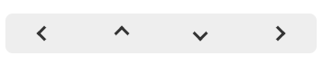

# Arrow组件  

## @1.0  

支持指向上、下、左、右四个方向的箭头组件，可以自定义箭头尺寸、颜色等。  

__引入路径__  
```js  
import Arrow from 'react-native-essential/components/Arrow/@1.0';
```  

__示例__  


__支持的属性__  

| 名称 | 类型 | 说明 | 是否必填 | 默认值 |
| - | - | - | :-: | :- | 
| direction | `left`/`up`/`right`/`down` | 方向 | 是 | 无 |  
| color | `string` | 颜色 | 是 | 无 |  
| size | `number` | 尺寸，指定箭头所在矩形区域宽高 | 是 | 无 |  
| lineSize | `number` | 箭头线条宽度 | 否 | 1 |  
| layoutStyle | `ViewStyle` | 布局样式，可以使用该属性自定义箭头的位置等布局属性，但不能改变尺寸和颜色、方向 | 否 | 无 |  