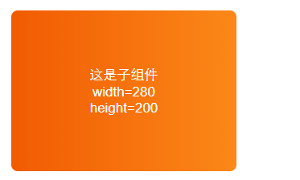
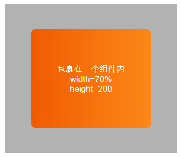

# GradientView组件

## @1.0

渐变背景组件，完全支持 CSS 中渐变颜色语法的组件，具体渐变颜色语法详见[`linear-gradient`](https://developer.mozilla.org/en-US/docs/Web/CSS/linear-gradient)。

**实现原理**

- 在`RN`端，使用`WebView`嵌套一个`html`文件，在该`html`文件内创建一个设置了渐变颜色的`div`元素
- 在`web`端，直接使用一个设置了渐变颜色的`div`元素

**引入路径**

```js
import GradientView from "react-native-essential/components/GradientView/@1.0";
```

**示例**  

  


**支持的属性**  

| 名称 | 类型 | 说明 | 是否必填 | 默认值 |  
| - | - | - | :-: | :- |  
| width | `string`/`number` | 宽，支持具体宽和百分比 | 是 | 无 |  
| height | `string`/`number` | 高，支持具体宽和百分比 | 是 | 无 |  
| background | `string` | 渐变背景色，具体语法参考[`linear-gradient`](https://developer.mozilla.org/en-US/docs/Web/CSS/linear-gradient) | 是 | 无 |  
| borderRadius | `string` | 组件圆角样式，具体语法参考[border-radius](https://developer.mozilla.org/en-US/docs/Web/CSS/border-radius) | 否 | 无 |  
| style | `string` | 组件布局的自定义样式，可以设置组件的`padding`和`margin`等样式 | 否 | 无 |
