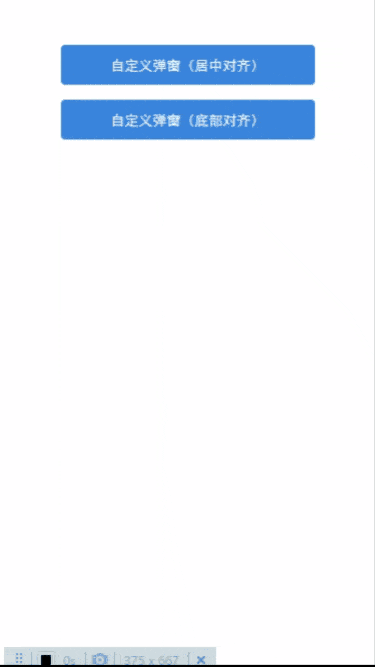

# Popup组件

## @1.0

弹窗组件。虽然该模块属于组件，但不会以组件的形式使用。该模块封装、输出了一个创建、显示弹窗的方法`Popup`。

**依赖**

_react-native-essential/constants/zindex_  
_react-native-essential/components/RootSibling/@1.0_

**引入路径**

```js
import { PopupClass, Popup } from "react-native-essential/components/Popup/@1.0";
```

**示例**

 

开发时所有的弹窗类效果，都可以使用此方法实现。简单使用示例如下：

```js  

import { PopupClass, Popup } from "react-native-essential/components/Popup/@1.0";

const openPopup = Popup(
  <View>
    <Button onPress={() => openPopup.destroy()} />
  </View>
);

```  

`Popup`方法包含两个参数：  

* `children`，`ReactElement`类型，表示弹窗内容  
* `props`，`PopupProps`类型，表示弹窗组件支持的属性  


通过第二个参数，也就是类型为`PopupProps`的对象配置想要的弹窗样式和效果。  

`PopupProps`类型主要包含以下属性：  

| 名称 | 类型 | 说明 | 是否必填 | 默认值 |  
| - | - | - | - | - |    
| align | `center`/`bottom` | 弹窗内容对齐方式 | 否 | `center` |  
| zIndex | `number` | zIndex值 | 否 | `1999` |  
| backgroundColor | `string` | 遮罩层背景色 | 否 | `rgba(0,0,0,0.3)` |  
| style | `ViewStyle` | 遮罩层自定义样式。_设置了该属性后，会覆盖前面的属性值，慎用！！！_ | 否 | 无 |  
| animated | `boolean` | 是否开启动画 | 否 | 无 |  
| animatedDuration | `number` | 动画时间 | 否 | `400` |  


`Popup`方法会返回一个`PopupClass`类型的实例，该类型只有一个方法`destroy`，通过调用该方法可以关闭、销毁创建的弹窗。