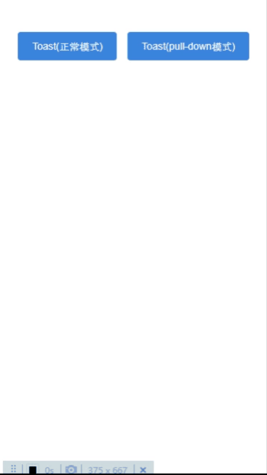

# Toast组件  

## @1.0  

提示组件。虽然该模块属于组件，但不会以组件的形式使用。该模块封装、输出了一个创建、显示提示的方法`Toast`。  

**依赖**

_react-native-essential/constants/zindex_  
_react-native-essential/components/Text/@1.0_  
_react-native-essential/components/MeasureSize/@1.0_  
_react-native-essential/components/RootSibling/@1.0_

**引入路径**

```js
import { default as Toast } from "react-native-essential/components/Toast/@1.0";
```

**示例**

   

`Toast`方法包含两个参数：  

* `message`，`string`/`ReactElement`类型，表示提示内容  
* `options`，`ToastOptions`类型，表示提示组件一些支持的属性  

**`ToastOptions`包含的属性**  

| 名称 | 类型 | 说明 | 是否必填 | 默认值 |  
| - | - | - | - | - |    
| mode | `push-up`/`pull-down` | 提示出现动画模式。`push-up`是上推模式，提示内容从屏幕中间向上缓缓移动一段距离。`pull-down`是下拉模式，提示内容从屏幕顶部缓缓移出。 | 否 | `push-up` |  
| animationDuration | `number` | 动画时间，单位是毫秒 | 否 | `500` |  
| hideDuration | `number` | 自动隐藏时间，单位是毫秒 | 否 | `1500` |  
| onHide | `function` | 提示窗自动隐藏时的回调函数 | 否 | 无 |  
| press2Hide | `boolean` | 是否开启点击隐藏，当内容是自定义组件时，不适用 | 否 | `true` |  